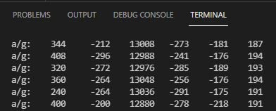
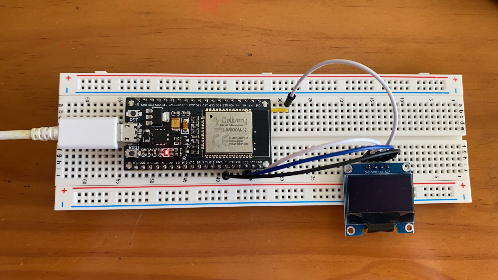
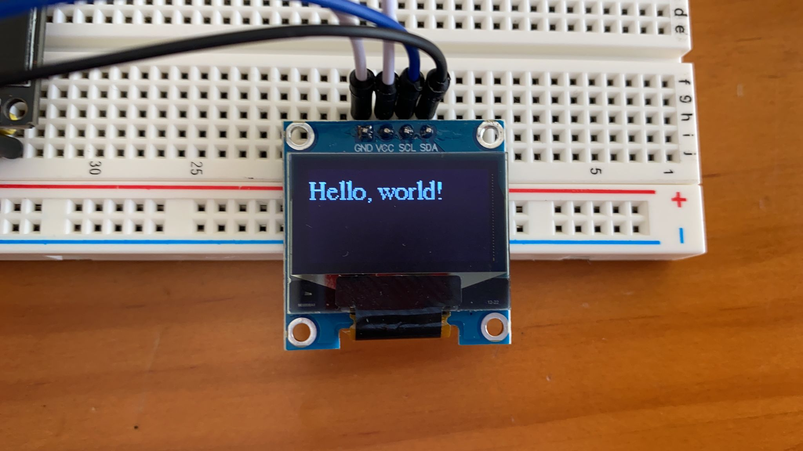

# PRÁCTICA 5: Buses de comunicación I (introducción y I2c)
## PRÁCTICA 5A (sensor de aceleración):
### Código:

```
#include <Arduino.h>
#include "I2Cdev.h"
#include "MPU6050.h"

// Arduino Wire library is required if I2Cdev I2CDEV_ARDUINO_WIRE implementation
// is used in I2Cdev.h
#if I2CDEV_IMPLEMENTATION == I2CDEV_ARDUINO_WIRE
#include "Wire.h"
#endif

// class default I2C address is 0x68
// specific I2C addresses may be passed as a parameter here
// AD0 low = 0x68 (default for InvenSense evaluation board)
// AD0 high = 0x69
MPU6050 accelgyro;
//MPU6050 accelgyro(0x69); // <-- use for AD0 high

int16_t ax, ay, az;
int16_t gx, gy, gz;


// uncomment "OUTPUT_READABLE_ACCELGYRO" if you want to see a tab-separated
// list of the accel X/Y/Z and then gyro X/Y/Z values in decimal. Easy to read,
// not so easy to parse, and slow(er) over UART.
#define OUTPUT_READABLE_ACCELGYRO

// uncomment "OUTPUT_BINARY_ACCELGYRO" to send all 6 axes of data as 16-bit
// binary, one right after the other. This is very fast (as fast as possible
// without compression or data loss), and easy to parse, but impossible to read
// for a human.
//#define OUTPUT_BINARY_ACCELGYRO


#define LED_PIN 13
bool blinkState = false;

void setup() {
    // join I2C bus (I2Cdev library doesn't do this automatically)
    #if I2CDEV_IMPLEMENTATION == I2CDEV_ARDUINO_WIRE
        Wire.begin();
    #elif I2CDEV_IMPLEMENTATION == I2CDEV_BUILTIN_FASTWIRE
        Fastwire::setup(400, true);
    #endif

    // initialize serial communication
    // (38400 chosen because it works as well at 8MHz as it does at 16MHz, but
    // it's really up to you depending on your project)
    Serial.begin(115200);

    // initialize device
    Serial.println("Initializing I2C devices...");
    accelgyro.initialize();

    // verify connection
    Serial.println("Testing device connections...");
    Serial.println(accelgyro.testConnection() ? "MPU6050 connection successful" : "MPU6050 connection failed");

    // use the code below to change accel/gyro offset values
    /*
    Serial.println("Updating internal sensor offsets...");
    // -76	-2359	1688	0	0	0
    Serial.print(accelgyro.getXAccelOffset()); Serial.print("\t"); // -76
    Serial.print(accelgyro.getYAccelOffset()); Serial.print("\t"); // -2359
    Serial.print(accelgyro.getZAccelOffset()); Serial.print("\t"); // 1688
    Serial.print(accelgyro.getXGyroOffset()); Serial.print("\t"); // 0
    Serial.print(accelgyro.getYGyroOffset()); Serial.print("\t"); // 0
    Serial.print(accelgyro.getZGyroOffset()); Serial.print("\t"); // 0
    Serial.print("\n");
    accelgyro.setXGyroOffset(220);
    accelgyro.setYGyroOffset(76);
    accelgyro.setZGyroOffset(-85);
    Serial.print(accelgyro.getXAccelOffset()); Serial.print("\t"); // -76
    Serial.print(accelgyro.getYAccelOffset()); Serial.print("\t"); // -2359
    Serial.print(accelgyro.getZAccelOffset()); Serial.print("\t"); // 1688
    Serial.print(accelgyro.getXGyroOffset()); Serial.print("\t"); // 0
    Serial.print(accelgyro.getYGyroOffset()); Serial.print("\t"); // 0
    Serial.print(accelgyro.getZGyroOffset()); Serial.print("\t"); // 0
    Serial.print("\n");
    */

    // configure Arduino LED pin for output
    pinMode(LED_PIN, OUTPUT);
}

void loop() {
    // read raw accel/gyro measurements from device
    accelgyro.getMotion6(&ax, &ay, &az, &gx, &gy, &gz);

    // these methods (and a few others) are also available
    //accelgyro.getAcceleration(&ax, &ay, &az);
    //accelgyro.getRotation(&gx, &gy, &gz);

    #ifdef OUTPUT_READABLE_ACCELGYRO
        // display tab-separated accel/gyro x/y/z values
        Serial.print("a/g:\t");
        Serial.print(ax); Serial.print("\t");
        Serial.print(ay); Serial.print("\t");
        Serial.print(az); Serial.print("\t");
        Serial.print(gx); Serial.print("\t");
        Serial.print(gy); Serial.print("\t");
        Serial.println(gz);
    #endif

    #ifdef OUTPUT_BINARY_ACCELGYRO
        Serial.write((uint8_t)(ax >> 8)); Serial.write((uint8_t)(ax & 0xFF));
        Serial.write((uint8_t)(ay >> 8)); Serial.write((uint8_t)(ay & 0xFF));
        Serial.write((uint8_t)(az >> 8)); Serial.write((uint8_t)(az & 0xFF));
        Serial.write((uint8_t)(gx >> 8)); Serial.write((uint8_t)(gx & 0xFF));
        Serial.write((uint8_t)(gy >> 8)); Serial.write((uint8_t)(gy & 0xFF));
        Serial.write((uint8_t)(gz >> 8)); Serial.write((uint8_t)(gz & 0xFF));
    #endif

    // blink LED to indicate activity
    blinkState = !blinkState;
    digitalWrite(LED_PIN, blinkState);
}
```

### Salida por el puerto serie:
Despues de compilar el programa y subirlo a la placa, el dispositivo comienza a funcionar. Este dispositivo se capta la aceleracion en el momento que se mueve. Al monitorearlo podemos obeservar como se muestran un seguido de coordenadas, las cuales iran variando respectivanete a medida que vayamos moviendo el sensor indicando hacia la posició a la cual este se mueve.




## PRÁCTICA 5B (display):
### Fotos del montaje:
GND -> GND
VCC -> 3,3V
SCL -> G22
SDA -> G21



### Salidas de depuracion:
Al ejecutar el programa el display muestra en su pantalla el mensaje de "Hola mundo".



### Código generado:
```
#include "Adafruit_I2CDevice.h"
#include <Wire.h>
#include <Adafruit_GFX.h>
#include <Adafruit_SSD1306.h>
#include <Fonts/FreeSerif9pt7b.h>

#define SCREEN_WIDTH 128 // OLED display width, in pixels
#define SCREEN_HEIGHT 64 // OLED display height, in pixels

// Declaration for an SSD1306 display connected to I2C (SDA, SCL pins)
Adafruit_SSD1306 display(SCREEN_WIDTH, SCREEN_HEIGHT, &Wire, -1);

void setup() {
  Serial.begin(115200);

  if(!display.begin(SSD1306_SWITCHCAPVCC, 0x3C)) { 
    Serial.println("SSD1306 allocation failed");
    for(;;);
  }
  delay(2000);

  delay(2000);
  display.clearDisplay();

  display.setTextSize(1);
  display.setTextColor(WHITE);
  display.setCursor(0, 10);
  // Display static text
  display.println("Hello, world!");
  display.display();  
}

void loop(){
}
```
### Explicación del código:
Para poder ejecutar primeramente necesitamos incororar las librerias que necesitas el dispositivo:
```
#include "Adafruit_I2CDevice.h"
#include <Wire.h>
#include <Adafruit_GFX.h>
#include <Adafruit_SSD1306.h>
#include <Fonts/FreeSerif9pt7b.h>
```

Definimos el ancho y la altura en nuestro caso de 128x64:
```
#define SCREEN_WIDTH 128 // OLED display width, in pixels
#define SCREEN_HEIGHT 64 // OLED display height, in pixels
```

Inicializamos el objeto de visualización con el ancho y alto definidos anteriormente con el protocolo de comunicación I2C (&Wire):
```
Adafruit_SSD1306 display(SCREEN_WIDTH, SCREEN_HEIGHT, &Wire, -1);
```

Inicializamos el Serial Monitor a una velocidad en baudios de 115200 para depurar:
```
Serial.begin(115200);
```

Inicializamos la pantala OLED, donde primeramente hacemos que muestre un mensaje que se mostrara por pantalla en el caso de que no nos podamos conectar a la pantalla.
```
if(!display.begin(SSD1306_SWITCHCAPVCC, 0x3C)) { 
    Serial.println("SSD1306 allocation failed");
    for(;;);
  }
```

Después de inicializar la pantalla, añadimos un retraso de dos segundos, para que el OLED tenga tiempo suficiente para inicializarse antes de escribir el texto:
```
delay(2000);
```

Después de inicializar la pantalla, borre el búfer de pantalla con el clearDisplay () método:
```
 display.clearDisplay();
```

Establecemos el tamño de la fuente:
```
display.setTextSize(1);
```

Definimos el color de la fuente:
```
display.setTextColor(WHITE);
```

Defina la posición donde comienza el texto:
```
display.setCursor(0, 10);
```

Finalmente, enviamos el texto a la pantalla:
```
display.println("Hello, world!");
```

Llamamos al "monitor()" método para mostrar realmente el texto en la pantalla:
```
display.display();
```